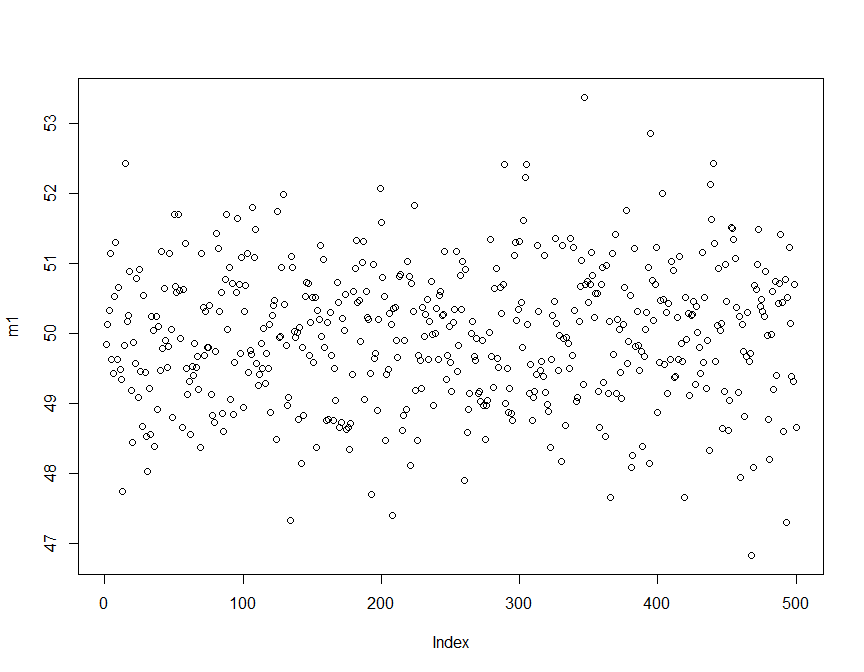

# Stat 581
Keon Kim, Agnes Ge and Zhaohu(Jonathan) Fan  
February 16, 2017  

## Background

- Public schools, K-12, aggregated in terms of 500 districts and 27 counties in Pennsylvania, respectively. 
- Total revenue allocated to public school is fixed.
- Total enrollment is fixed.
- Only a fixed term, one year.

## Goals

- Max per-pupil revenue over two methods: districts-based method and counties-based method.
- Analysis: 1) Range method 2) Normalized Gini Index.

## Methodology

- Districts-based method 
    - Step 1  Total revenue, R, is divided by the total number of districts, D.
    
       \begin{equation}
         r_d=\frac{R}{D}
       \end{equation}
    - Step 2  Total revenue per district is divided by  total enrollment in each districts, E(i). 
    
      \begin{equation}
         r_d(i)=\frac{ r_d}{E(i)}, i=1,\cdots, 500.
       \end{equation}
- Counties-based method
    - Step 1 Total revenue, R, is divided by the total number of counties, C.
      \begin{equation}
         r_c=\frac{R}{C}
       \end{equation}
    - Step 2 Total revenue per county is divided by  total enrollment in each counties, E(j).
    
      \begin{equation}
         r_e(i)=\frac{ r_c}{ E^{\ast}(j)}, j=1,\cdots, 27.
       \end{equation}
- Cutoff 
         
      \begin{equation}
         Cutoff=\frac{R}{\sum_{i=1}^{500} E(i)}.
       \end{equation}

## Simulation
- Districts-based method 
<!-- -->
- Counties-based method
<!-- -->

## Analysis

 - Range method.
 - Normalized Gini Index.
 - Coefficient of Variation and McLoone Index. 
## Research questions

- Multiple years data sets available.

